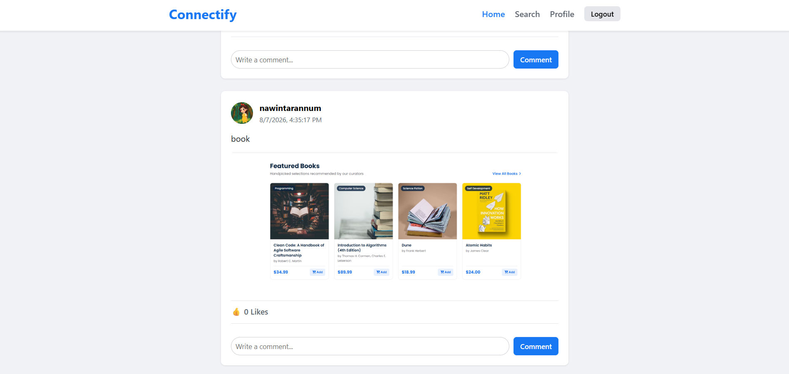
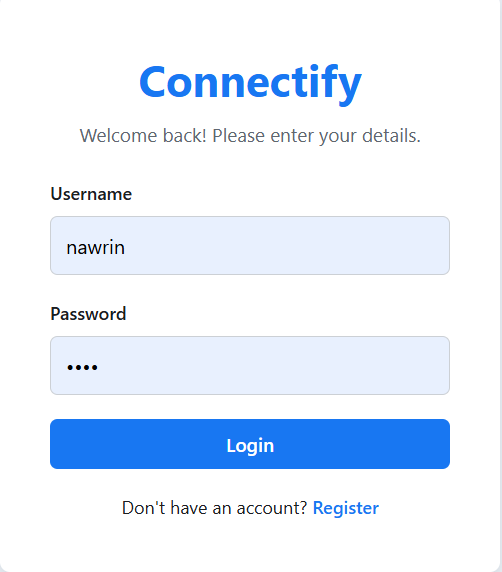
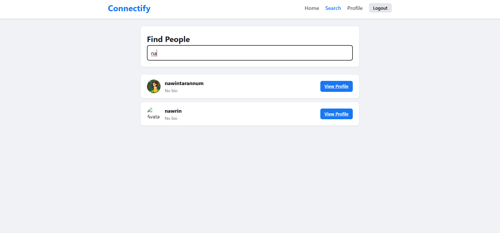
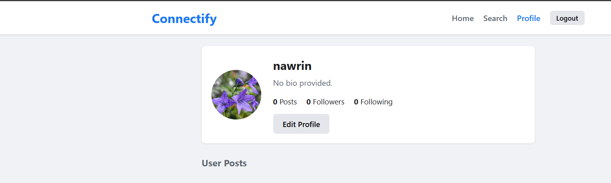

# Connectify - Mini Social Media Platform

Connectify is a simple, lightweight, full-stack mini social media web application developed using **Node.js**, **Express.js**, **SQLite**, and standard **Vanilla JavaScript**, **HTML**, and **CSS**.

---
## live demo:  https://nawrin30.github.io/CodeAlpha_Social-Media-Platform-connectify-/

## 🛠 Tech Stack

* **Frontend:** HTML5, CSS3, Vanilla JavaScript (ES6+)
* **Backend:** Node.js, Express.js
* **Database:** SQLite (`sqlite3`)
* **Session & Authentication:** `express-session`, `bcryptjs`
* **File Uploads:** `multer`

---
## Dashboard Preview








## 📁 Project Folder Structure

```text
connectify/
├── package.json
├── server.js
├── database.db                 # Auto-generated when server runs
├── README.md
├── config/
│   └── database.js             # SQLite connection configuration
├── models/
│   └── databaseModels.js       # Database schema initialization
├── middleware/
│   └── authMiddleware.js       # Session authentication check
├── controllers/
│   ├── authController.js       # Auth handlers (login, register, logout)
│   ├── userController.js       # Profile, search, and follow handlers
│   ├── postController.js       # Post creation, edit, delete, like handlers
│   └── commentController.js    # Comment creation and deletion handlers
├── routes/
│   ├── authRoutes.js
│   ├── userRoutes.js
│   ├── postRoutes.js
│   └── commentRoutes.js
├── public/                     # Static frontend files
│   ├── index.html              # News feed / Home page
│   ├── login.html
│   ├── register.html
│   ├── profile.html
│   ├── search.html
│   ├── css/
│   │   └── style.css
│   └── js/
│       ├── auth.js
│       ├── home.js
│       ├── profile.js
│       └── search.js
└── uploads/                    # Stores uploaded media
    ├── profiles/               # User profile avatars
    └── posts/                  # Post images